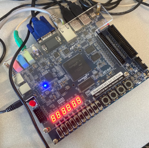
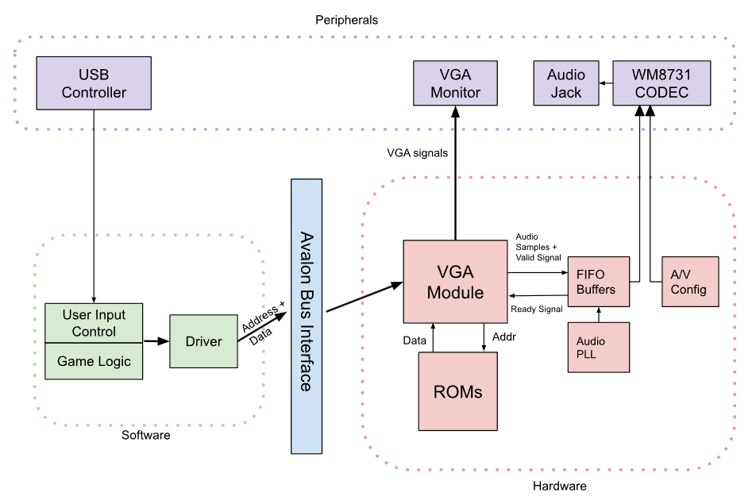
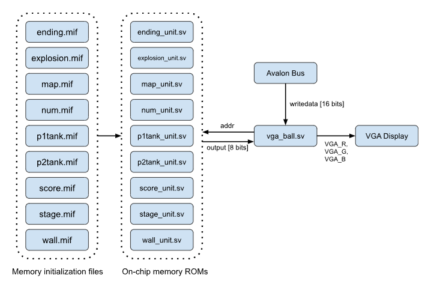
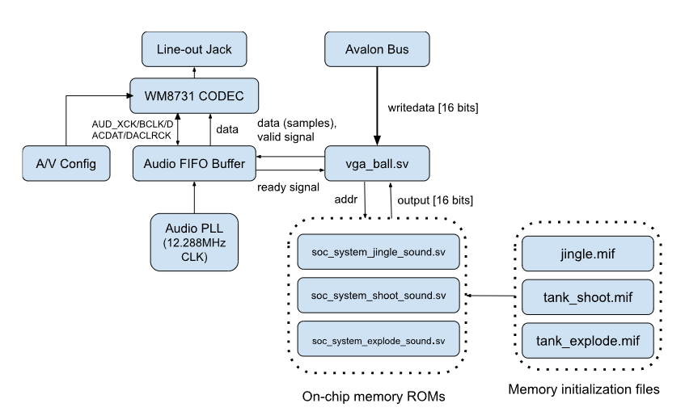
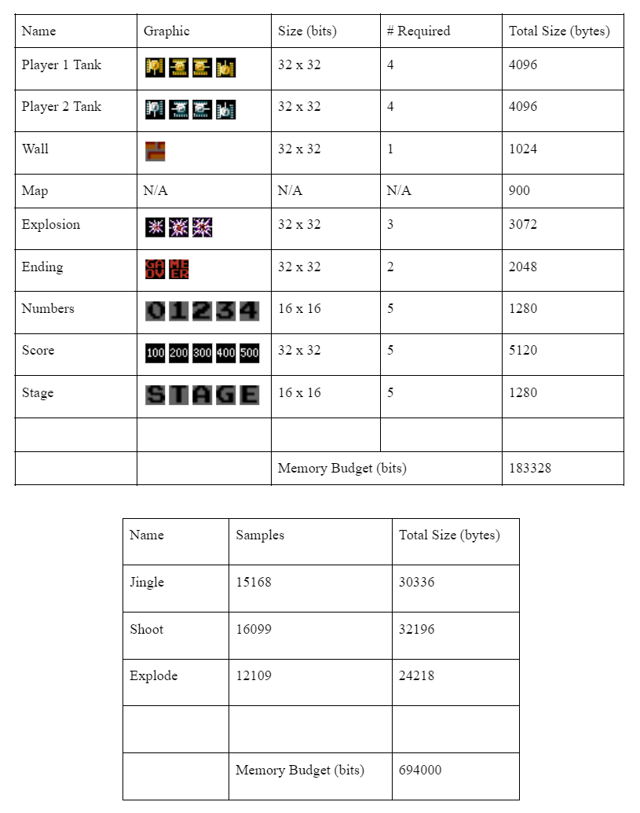
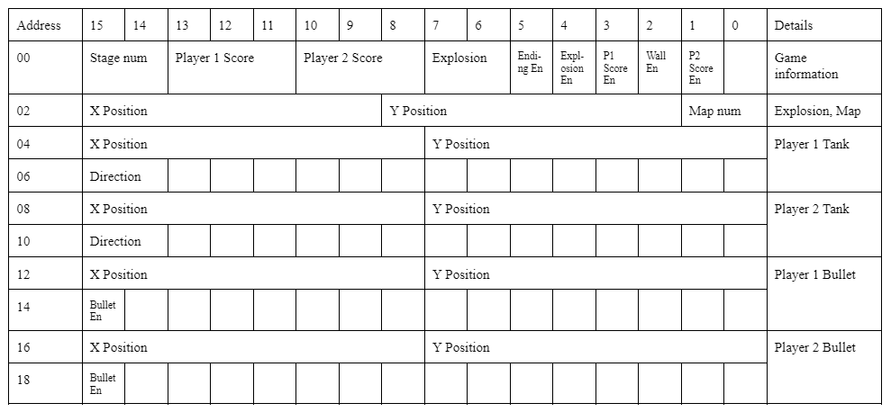
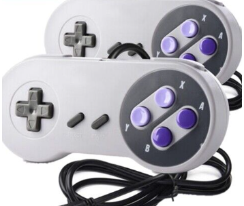
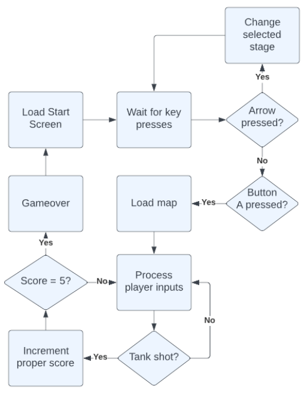

# Embedded-System-Tank-Game
Multiplayer tank game implemented on the DE1-SoC Cyclone V Board. Based on Battle City for the NES, runs with 2 controllers, uses VGA for video and the WM8731 CODEC for audio.
  

  
   
  <em>Figure 1: Tank Game VGA Monitor Display.</em>

  

  
   
  <em>Figure 2: DE1-SoC Cyclone V FPGA.</em>

# Authors

👨‍💻 **Quinn Booth** - `qab2004@columbia.edu`

👩‍💻 **Ganesan Narayanan**

👨‍💻 **Ana Maria Rodrigues**

👨‍🏫 **Professor Stephen Edwards** - *Code Skeleton* 

# Table of Contents

- [Introduction](#introduction)
    - [Game Overview & Rules](#gameoverview)
    - [System Architecture](#architecture)
- [Hardware](#hardware)
    - [Graphics](#graphics)
    - [Audio](#audio)
    - [Memory](#memory)
- [Software](#software)
    - [Avalon Bus Interface](#bus)
    - [Controllers](#control)
    - [Game Logic](#gamelogic)
- [References](#references)

# Introduction 

### Game Overview & Rules 

Our game of Tanks is a 2-player tank maze game based on the original Tank arcade game developed in 1974 by a subsidiary of Atari. In our game, two players move tanks around in a maze viewed from above, while attempting to shoot the opposing player’s tank. Players use game controllers to control their tank, moving with the arrow buttons and shooting bullets with the A button. Bullets cannot go through walls and when a bullet hits the other player’s tank, it explodes and they gain 100 points. The first player to reach 500 points wins.

Upon startup, Player 1 must select the map to be played. We have designed three different maps for the players to select. Using the up/down arrows on the controller, they can select from the desired stage, with higher number stages being more complex in maze design. To start the game, Player 1 must press the A button. Once a player reaches 500 points and wins, the game is over and the players are taken back to the stage selection screen.

### System Architecture 
  

  
   
  <em>Figure 3: Block Diagram.</em>

Players control the movement of tanks using game controllers, interfacing with the software controlling the game logic by communicating through the USB protocol. The software then communicates to the FPGA hardware using a device driver, which then handles displaying the graphics for the game on the VGA monitor and decides when to play audio cues. 

The software components involve the main game logic hello.c file, which handles the logic of tank movement, bullet shooting, and scoring. The controller.c file recognizes and initializes inputs from the USB controller controllers so that the game logic can be carried out, communicating through the USB protocol and libusb library. Finally, the vga ball.c file device driver communicates to the vga_module.sv through the Avalon bus interface to update the graphics that will be displayed on the VGA monitor based on the game logic.

The hardware peripherals include the USB controllers, through which players input is passed, and the VGA monitor, which displays the output of the game itself. The hardware consists of on-chip memory ROMs on the FPGA in which all the necessary sprite data will be stored and the vga_ball module file that displays the requisite graphical information based on the screen location on the VGA display. The vga_ball module sends addresses to the ROMs which returns the requested output sprite data. It then communicates with the VGA monitor hardware peripheral to display the graphics. Additionally, we connect earbuds or a speaker to the WM8731 CODEC.

# Hardware 

### Graphics 

The main hardware algorithm is the logic to display the graphics. The sprites we used for our graphics are stored in on chip memory ROMs created and configured through the on-chip system memory IP blocks in Platform Designer. The .png images for our sprites (taken from the Battle City game) were converted into .mif memory initialization files to prepopulate the ROMs.

To display the graphics, the addresses to be read from the respective ROMs are determined by the ioctl writes from the device driver and location on the display. The values stored in the ROMs specified by the .mif files are a hex value for each pixel in the image, with each pixel corresponding to an address in memory. This output hex value is used to look-up the values to pass to the VGA RGB signals and determine the color to display on the screen (for a total of 16 different colors) at that current location.

The graphics architecture is shown below. The vga_ball module contains modules to determine the position on the screen and to set the RGB pixel values on the VGA display. Through the Avalon bus interface, 16 bit data is passed from the software using the device drivers to vga_ball.sv to indicate the when and where graphics should be displayed. Using this information and the hcount and count coordinate positions, the vga_ball.sv passes addresses to the instantiated on-chip memory ROMs, which return 8-bit output values that are used to determine the output VGA_R, VGA_G, VGA_B signals to the display. The ROMs are initialized with the memory initialization files that populate the memory contents with the requisite sprite data.
  

  
   
  <em>Figure 4: Graphics Architecture.</em>

### Audio 

To store the audio files in memory, we had to convert them to a specific formatting. After downloading the .mp3 files we wanted to use in our game, we converted them to .wav files in Audacity. We also swapped the files from stereo to mono (as we will only be playing one stream of audio), cropped them to a desirable length (to save memory), re-sampled the audio at 8 kHz, and converted them to signed 16-bit PCIM binary encoding. The .mp3s were then converted into .mif file format. 

The .mif files were used to prepopulate the on-chip memory ROMs to contain the music data. We modified the Qsys interface such that our audio samples would be properly fed into the WM8731 CODEC. The 3 main components involved were: the altera_up_avalon_audio_pll, the alterra_up_avalon_audio_and_video_config, and the altera_up_avalon_audio IPs. The altera_up_avalon_audio_pll acts as a clock divider. As the CODEC does not operate on our standard 50 MHz, the PLL is needed to create a 12.288 MHz clock frequency, using the 50 MHz clock as a reference. The altera_up_avalon_audio_and_video_config sets up our peripheral audio device – configures the CODEC – given our initialization arguments: left-justified data format, 16 bit length, etc. The altera_up_avalon_audio facilitates a transfer of audio between our WM8731 CODEC and FPGA through right and left channels implemented as FIFOs. Together, these IP blocks gave us a data channel and clock prepared for the line out jack through the Wolfson WM8731 CODEC.

soc_system.qsys contains our final Qsys connections that facilitate audio data transfer between our FPGA and WM8731 CODEC peripheral. vga_ball_0 has avalon_streaming_interfaces for both the left and right channels, with each of these interfaces having a ready, valid, and data signal. These signals are used to judge when the CODEC FIFOs are prepared to accept audio samples. The audio loop waits for the altera_up_avalon_audio IP to send a HIGH ready signal and proceeds to count up to a threshold, slowing our data transfer to an intelligible rate. Once this threshold is met, valid signals go HIGH and depending on the game event, some audio sample is passed to the CODEC through the altera_up_avalon_audio.
  

  
   
  <em>Figure 5: Audio Architecture.</em>

### Memory 

The FPGA includes 4450 Kbits of embedded memory. The sprites and audio required for our project are shown in the table below. Note that the value for each pixel in the sprite images was stored as a one byte hex value. Additionally, each audio sample is stored in memory as a signed 16-bit integer to be fed into the WM8731 CODEC. In all, for our sprites we utilized ~183 Kbits of memory, while for our audio we used ~694 Kbits. This totals to ~877 Kbits, which is less than the embedded memory in the FPGA.
  

  
   
  <em>Figure 6: Memory Considerations.</em>

# Software 

### Avalon Bus Interface 

Communication from the software to the hardware is done through the device driver. Ioctl16 writes of 16 bits are made to 10 different registers to send data information from the software for handling by the hardware graphics. The Avalon bus interface is specified below.

There are a total of 10 2-byte registers that we use, performing writes of 16 bits to pass data from the software to the hardware. Address 00 is for data such as the stage num, player scores, explosion graphic, and various enable bits to turn on the respective graphics. Address 02 is the coordinates for the explosion and the selected map number. Addresses 04 and 06 are for player 1 tank information including the coordinates and direction, and addresses 08 and 10 are for the player 2 tank. Addresses 12 and 14 are for the player 1 bullet coordinates and enable, and addresses 16 and 18 for the player 2 bullet. 
  

  
   
  <em>Figure 7: Avalon Bus Interface.</em>

 

### Controllers 

Players interact with the game using a pair of iNNext game controllers, which can be seen below. The controllers are connected via USB and are identified by an idProduct of 17 and have just a single interface, using the libusb library. Players can move the tanks up/down/left/right using the arrow keys on the controllers, and fire a bullet using the A button. Counter variables were used for each of the arrow keys and A button to slow down the input speed and to in effect debounce the switches so that a single physical press was only registered as a single press of the button on the software side. Both of the controller inputs are handled in a single loop as threads were not necessary to maintain fast and simultaneous input latency.
  

  
   
  <em>Figure 8: iNNext Controllers.</em>

  
With two connected controllers, we sequentially used libusb_interrupt_transfer from the libusb library to read their 7 byte protocol messages. Each controller communicates using the following 7 byte protocol:
  

|    Byte 0     |     Byte 1    |     Byte 2    |      Byte 3     |      Byte 4     |      Byte 5     | Byte 6 |
|----------|----------|----------|------------|------------|------------|------------------------------|
| Constant | Constant | Constant | L/R Arrows | U/D Arrows | X, Y, A, B | L/R Bumpers, Select, Start |

There are three constant fields at the beginning of each controller packet, describing the protocol. Our controller is not identified by one of the libusb built in protocols, so it fills these fields with 255 in each. This corresponds to ‘protocol 0,’ whereas an identifiable protocol such as that of keyboards might be ‘protocol 1.’ For the left/right field, it defaults to a 127 integer, which changes to 0 if left is pressed, or 255 if right is pressed. The up/down field works the same way, dropping to 0 if up is pressed; 255 if down is pressed. The X, Y, A, B field has a more complex representation of button presses. It has an additive scheme, where pressing different keys adds to the integer total. The Left_Buffer, Right_Buffer, Start, Select field operates in the same way, simply replacing the X, Y, A, B keys.
  

### Game Logic 

The userspace program to handle the game logic has three primary loops– 1) loop to restart the game, 2) loop to select the stage, 3) loop to play the game. Upon startup, the currently selected stage is displayed on the screen and the program listens for user input from controller 1. The stage number corresponds to which map will be selected, with there being 3 different playable maps. When the up arrow is pressed, the stage number increments and the player tanks displayed move in a little animation. The speed of the animation is dependent on the stage number selected and acts as an indication to the complexity of the selected map. When the down arrow is pressed, the stage number decrements. The user selects the current stage and starts the game by pressing the A button. Once the game starts, the players are free to move around the maze and fire bullets at the opponent’s tank. Tanks and bullets cannot move through walls.
  

  
   
  <em>Figure 9: Game Loop.</em>

 
Tank movement is discretized in increments to give the game a familiar feel and aid player movement around and through the block maze. We decided to keep the tank movement speed constant. Holding the arrow key moves the tank continually in the specified direction. When the player presses a different arrow key and the intended spot is vacant, the tank turns in that direction. The Player 1 tank is gold in color and the Player 2 tank is silver. Valid player movement is determined through collision detection with both the walls of the maze and the opponent tank. The coordinates of the tank are truncated into a 32 bit value for each x and y direction, yielding a 20x15 grid, and used to determine an overlap between tank and wall or tank and tank and prevent movement through. 

Players can only fire one bullet at a time. The bullet for Player 1 matches the gold color of the Player 1 tank and the bullet for Player 2 matches the silver color for the Player 2 tank. Bullets move faster than tanks and fire in the current direction the tank is facing. Once the bullet hits a wall, it disappears, and the player is able to fire a new bullet. If the bullet hits the opponent’s tank, the tank explodes and the bullet disappears. Bullet collision is detected in the same manner as tank and wall collisions as described above. Separate threads are used for each of the players’ bullets so that the bullets can fire and move simultaneously with the tanks themselves, which are handled by the main thread of the program. 

Successfully shooting the opponent’s tank gives the player 100 points, indicated by the score at the top of the screen. Player 1’s score is on the left side and Player 2’s score is on the right. The first player to land 5 hits on the opponent and score 500 points wins the game, upon which the “gameover” graphic is displayed on top of the maze and the game resets back to the stage selection screen for replay.

# References 

[1] http://www.cs.columbia.edu/~sedwards/classes/2023/4840-spring/index.html

[2] https://projectf.io/posts/hardware-sprites/

[3] https://github.com/projf/fpgatools

[4] https://github.com/0x60/385-audio-tools

[5] https://www.cl.cam.ac.uk/teaching/1617/ECAD+Arch/optional-tonegen.html