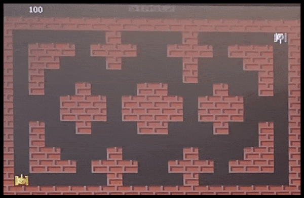

# Embedded-System-Tank-Game
Multiplayer tank game implemented on the DE1-SoC Cyclone V Board. Based on Battle City for the NES, runs with 2 controllers, uses VGA for video and the WM8731 CODEC for audio.
  

  
   
  <em>Figure 1: Tank Game VGA Monitor Display.</em>

  

  
   
  <em>Figure 2: DE1-SoC Cyclone V FPGA.</em>

# Authors

👨‍💻 **Quinn Booth** - `qab2004@columbia.edu`

👩‍💻 **Ganesan Narayanan**

👨‍💻 **Ana Maria Rodrigues**

👨‍🏫 **Professor Stephen Edwards** - *Code Skeleton* 

# Table of Contents

- [Introduction](#introduction)
    - [Game Overview & Rules](#gameoverview)
    - [System Architecture](#architecture)
- [Hardware](#hardware)
    - [Graphics](#graphics)
    - [Audio](#audio)
    - [Memory](#memory)
- [Software](#software)
    - [Avalon Bus Interface](#bus)
    - [User Input](#userinput)
        - [Controls Overview](#controls)
        - [Communication Protocol](#protocol)
    - [Game Logic](#gamelogic)
        - [Game Loop](#gameloop)
        - [Tank Movement](#movement)
        - [Collision Detection](#collision)
        - [Bullet Firing](#bullet)
        - [Win Condition](#win)
- [References](#references)

# Introduction 

### Game Overview & Rules 

Our game of Tanks is a 2-player tank maze game based on the original Tank arcade game developed in 1974 by a subsidiary of Atari. In our game, two players move tanks around in a maze viewed from above, while attempting to shoot the opposing player’s tank. Players use game controllers to control their tank, moving with the arrow buttons and shooting bullets with the A button. Bullets cannot go through walls and when a bullet hits the other player’s tank, it explodes and they gain 100 points. The first player to reach 500 points wins.

Upon startup, Player 1 must select the map to be played. We have designed three different maps for the players to select. Using the up/down arrows on the controller, they can select from the desired stage, with higher number stages being more complex in maze design. To start the game, Player 1 must press the A button. Once a player reaches 500 points and wins, the game is over and the players are taken back to the stage selection screen.

## System Architecture 